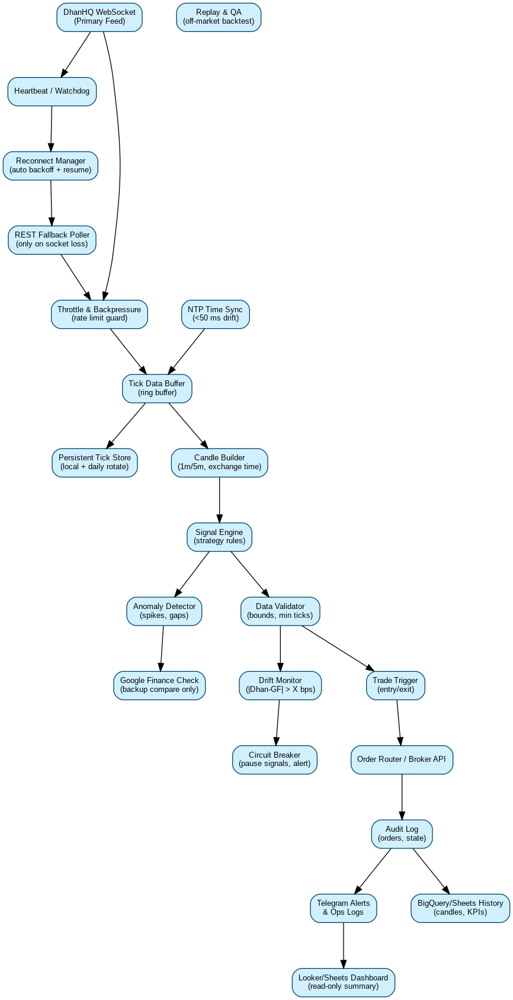

# Teevra 18
 

**Goal:** Build once against small interfaces, then swap data/execution adapters (Zerodha → DhanHQ) without rewriting strategy/ops.

## Repo Layout
- ridge/ — MarketBridge service (data in/out; adapters later: Zerodha → DhanHQ)
-  ppsscript/ — Google Apps Script sources (bound to Google Sheet)
- docs/ — diagrams, runbooks (place data-flow here)
- acktests/ — CSVs, notebooks, experiments

## Stage 0 — Foundations (Day 0–1)
**Deliverables**
- Google Sheet: **Teevra18** (tabs: config, symbols, heartbeat, signals, orders_paper, logs)
- Apps Script bound to the Sheet (Web App endpoint + Telegram test sender)
- Telegram bot & chat ID verified
- Repo scaffold (this repo) created

**Secrets & Config**
- **Apps Script Script Properties:** TELEGRAM_BOT_TOKEN, TELEGRAM_CHAT_ID, JWT_SECRET, ENV
- **bridge/.env:** KITE_API_KEY, KITE_API_SECRET, ACCESS_TOKEN (daily), SHEETS_ENDPOINT, SHEETS_JWT

**Acceptance (Stage 0 = DONE when all true)**
- GET /health on Bridge returns { ok: true, ... }
- Telegram test message received from the Sheet menu
- POST /ping from Bridge writes a new row to the Sheet’s heartbeat tab

## Diagram
Place your data-flow image in docs/ and reference it here:

## Notes
- Never commit secrets. .env is ignored by .gitignore.
- Next stages add Zerodha data adapter (then DhanHQ drop-in), paper exec (+7s), and Telegram alerts.
