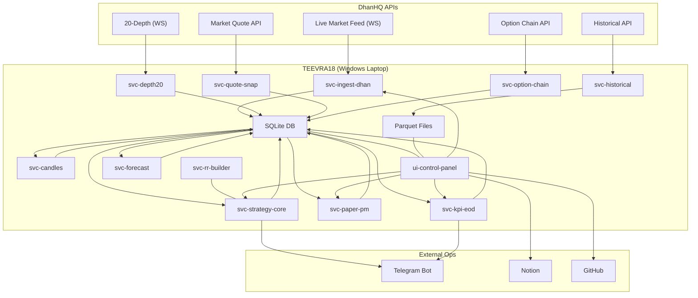

# Teevra18 — Architecture & Pipeline

_Last updated: 2025-08-26 10:45:55_

## System Architecture (Mermaid)

```mermaid
graph TD
  subgraph DhanHQ["DhanHQ APIs"]
    LMF["Live Market Feed (WS)"]
    MQA["Market Quote API"]
    D20["20-Depth (WS)"]
    HIST["Historical API"]
    OCH["Option Chain API"]
  end
  subgraph Local["TEEVRA18 (Windows Laptop)"]
    ING["svc-ingest-dhan"]
    QSN["svc-quote-snap"]
    DEP["svc-depth20"]
    CAN["svc-candles"]
    OCF["svc-option-chain"]
    HIS["svc-historical"]
    RRB["svc-rr-builder"]
    STR["svc-strategy-core"]
    PAP["svc-paper-pm"]
    KPI["svc-kpi-eod"]
    PRD["svc-forecast"]
    UI["ui-control-panel"]
    DB["SQLite DB"]
    PAR["Parquet Files"]
  end
  subgraph Ops["External Ops"]
    TGM["Telegram Bot"]
    NOT["Notion"]
    GIT["GitHub"]
  end
  LMF --> ING --> DB
  D20 --> DEP --> DB
  MQA --> QSN --> DB
  OCH --> OCF --> DB
  HIST --> HIS --> PAR
  DB --> CAN --> DB
  DB --> STR --> DB
  DB --> PAP --> DB
  DB --> KPI --> DB
  DB --> PRD --> DB
  RRB --- STR
  UI --> ING
  UI --> STR
  UI --> PAP
  UI --> KPI
  DB --- UI
  PAR --- UI
  STR --> TGM
  KPI --> TGM
  UI --> NOT
  UI --> GIT
```
