# Database Schema (auto-generated)

_Last updated: 2025-08-26 10:50:05_

## Tables

### backtest_orders
```sql
CREATE TABLE backtest_orders (
  id INTEGER PRIMARY KEY AUTOINCREMENT,
  run_id TEXT NOT NULL,
  symbol TEXT NOT NULL,
  strategy_id TEXT NOT NULL,
  side TEXT NOT NULL CHECK (side IN ('BUY','SELL')),
  ts_entry TEXT, ts_exit TEXT,
  entry REAL, exit REAL,
  qty INTEGER NOT NULL DEFAULT 1,
  pnl REAL, rr REAL, sl REAL, tp REAL,
  tags TEXT
)
```

### breaker_state
```sql
CREATE TABLE breaker_state (
  id INTEGER PRIMARY KEY CHECK (id=1),
  state TEXT NOT NULL CHECK (state IN ('RUNNING','PAUSED','PANIC')),
  reason TEXT,
  updated_at TEXT NOT NULL DEFAULT (datetime('now'))
)
```

### candles_15m
```sql
CREATE TABLE candles_15m (
  ts_start TEXT NOT NULL,
  symbol TEXT NOT NULL,
  open REAL, high REAL, low REAL, close REAL,
  volume INTEGER, oi INTEGER,
  PRIMARY KEY (symbol, ts_start)
)
```

### candles_1m
```sql
CREATE TABLE candles_1m (
  ts_start TEXT NOT NULL,
  symbol TEXT NOT NULL,
  open REAL, high REAL, low REAL, close REAL,
  volume INTEGER, oi INTEGER,
  PRIMARY KEY (symbol, ts_start)
)
```

### candles_5m
```sql
CREATE TABLE candles_5m (
  ts_start TEXT NOT NULL,
  symbol TEXT NOT NULL,
  open REAL, high REAL, low REAL, close REAL,
  volume INTEGER, oi INTEGER,
  PRIMARY KEY (symbol, ts_start)
)
```

### candles_60m
```sql
CREATE TABLE candles_60m (
  ts_start TEXT NOT NULL,
  symbol TEXT NOT NULL,
  open REAL, high REAL, low REAL, close REAL,
  volume INTEGER, oi INTEGER,
  PRIMARY KEY (symbol, ts_start)
)
```

### config_meta
```sql
CREATE TABLE config_meta (
  key TEXT PRIMARY KEY,
  value TEXT,
  updated_at TEXT DEFAULT (datetime('now'))
)
```

### depth20_snap
```sql
CREATE TABLE depth20_snap (
  id INTEGER PRIMARY KEY AUTOINCREMENT,
  ts TEXT NOT NULL,
  symbol TEXT NOT NULL,
  bids_json TEXT NOT NULL,           -- top 20 levels
  asks_json TEXT NOT NULL,
  best_bid REAL, best_ask REAL,
  bid_sz INTEGER, ask_sz INTEGER
)
```

### health
```sql
CREATE TABLE "health" (
  key    TEXT PRIMARY KEY,
  value  TEXT NOT NULL,
  ts_utc TEXT NOT NULL
)
```

### instrument_master
```sql
CREATE TABLE instrument_master (
  security_id       INTEGER PRIMARY KEY,
  exchange_segment  INTEGER,
  display_name      TEXT,
  underlying_id     INTEGER,
  lot_size          INTEGER
)
```

### kpi_daily
```sql
CREATE TABLE kpi_daily (
  date TEXT PRIMARY KEY,             -- YYYY-MM-DD
  total_signals INTEGER,
  total_trades INTEGER,
  win_rate REAL,
  gross_pnl REAL,
  net_pnl REAL,
  avg_rr REAL,
  notes TEXT
)
```

### live_journal
```sql
CREATE TABLE live_journal (
  id INTEGER PRIMARY KEY AUTOINCREMENT,
  ts TEXT NOT NULL DEFAULT (datetime('now')),
  text TEXT,
  tag TEXT
)
```

### ops_log
```sql
CREATE TABLE "ops_log" (
  ts_utc TEXT NOT NULL,
  level  TEXT NOT NULL,
  area   TEXT NOT NULL,
  msg    TEXT NOT NULL
)
```

### option_chain_snap
```sql
CREATE TABLE option_chain_snap (
  id INTEGER PRIMARY KEY AUTOINCREMENT,
  ts TEXT NOT NULL,
  underlying_symbol TEXT NOT NULL,
  expiry DATE NOT NULL,
  chain_json TEXT NOT NULL,          -- compact per strike per side
  iv_mean REAL,                      -- optional quick stat
  put_call_oi_ratio REAL
)
```

### paper_orders
```sql
CREATE TABLE paper_orders (
  id INTEGER PRIMARY KEY AUTOINCREMENT,
  signal_id TEXT NOT NULL,
  ts_signal TEXT NOT NULL,
  ts_fill TEXT,
  symbol TEXT NOT NULL,
  side TEXT NOT NULL CHECK (side IN ('BUY','SELL')),
  qty INTEGER NOT NULL DEFAULT 1,
  entry REAL, sl REAL, tp REAL,
  status TEXT NOT NULL DEFAULT 'OPEN' CHECK (status IN ('OPEN','SL_HIT','TP_HIT','CANCELLED','EXPIRED','CLOSED')),
  pnl REAL,
  notes TEXT,
  UNIQUE(signal_id),
  FOREIGN KEY (signal_id) REFERENCES signals(id)
)
```

### policies_group
```sql
CREATE TABLE policies_group (
  group_id TEXT PRIMARY KEY,         -- e.g., 'INDEX', 'NIFTY50', 'OPTIONS'
  description TEXT,
  max_trades_per_day INTEGER,
  rr_min REAL,                       -- minimum risk:reward
  sl_cap_per_lot REAL                -- rupees
)
```

### policies_instrument
```sql
CREATE TABLE policies_instrument (
  id INTEGER PRIMARY KEY AUTOINCREMENT,
  symbol TEXT NOT NULL,
  group_id TEXT NOT NULL,
  enabled INTEGER NOT NULL DEFAULT 1,
  overrides_json TEXT,
  UNIQUE(symbol),
  FOREIGN KEY (group_id) REFERENCES policies_group(group_id)
)
```

### predictions
```sql
CREATE TABLE predictions (
  id INTEGER PRIMARY KEY AUTOINCREMENT,
  ts TEXT NOT NULL,
  symbol TEXT NOT NULL,
  horizon_min INTEGER NOT NULL,
  prob_up REAL,                      -- model probability
  expected_move REAL,                -- abs pct or points
  model_id TEXT,
  features_json TEXT
)
```

### quote_snap
```sql
CREATE TABLE quote_snap (
  ts TEXT NOT NULL,
  symbol TEXT NOT NULL,
  ltp REAL,
  open REAL, high REAL, low REAL, prev_close REAL,
  volume INTEGER,
  PRIMARY KEY (symbol, ts)
)
```

### rr_overrides
```sql
CREATE TABLE rr_overrides (
  id INTEGER PRIMARY KEY AUTOINCREMENT,
  symbol TEXT NOT NULL,
  profile_name TEXT NOT NULL,
  start_ts TEXT,
  end_ts TEXT,
  reason TEXT,
  FOREIGN KEY (profile_name) REFERENCES rr_profiles(profile_name)
)
```

### rr_profiles
```sql
CREATE TABLE rr_profiles (
  profile_name TEXT PRIMARY KEY,     -- e.g., 'BASELINE'
  rr_min REAL NOT NULL,              -- >= 2.0
  sl_cap_per_lot REAL NOT NULL,      -- <= 1000
  sl_method TEXT,                    -- e.g., 'ATR'
  tp_method TEXT,                    -- e.g., 'RR'
  tp_factor REAL,                    -- e.g., 2.0
  spread_buffer_ticks REAL,
  min_liquidity_lots REAL
)
```

### signals
```sql
CREATE TABLE signals (
  id TEXT PRIMARY KEY,               -- nonce/uuid for idempotency
  ts TEXT NOT NULL,
  symbol TEXT NOT NULL,
  strategy_id TEXT NOT NULL,
  side TEXT NOT NULL CHECK (side IN ('BUY','SELL')),
  entry REAL NOT NULL,
  sl REAL NOT NULL,
  tp REAL NOT NULL,
  rr REAL NOT NULL,                  -- computed RR
  profile_name TEXT,                 -- RR profile used
  rr_ok INTEGER NOT NULL DEFAULT 0,  -- 1 if rr>=min and sl<=cap
  status TEXT NOT NULL DEFAULT 'NEW' CHECK (status IN ('NEW','CANCELLED','FILLED','REJECTED')),
  reason TEXT,
  extra_json TEXT
)
```

### strategies_catalog
```sql
CREATE TABLE strategies_catalog (
  strategy_id TEXT PRIMARY KEY,      -- e.g., 'ema_vwap_atr'
  name TEXT,
  version TEXT,
  params_json TEXT,
  enabled INTEGER NOT NULL DEFAULT 1
)
```

### ticks_raw
```sql
CREATE TABLE "ticks_raw" (
      ts_utc            TEXT NOT NULL,
      exchange_segment  INTEGER NOT NULL,
      security_id       INTEGER NOT NULL,
      mode              TEXT NOT NULL,
      ltt_epoch         INTEGER,
      ltp               REAL,
      atp               REAL,
      last_qty          INTEGER,
      volume            INTEGER,
      buy_qty_total     INTEGER,
      sell_qty_total    INTEGER,
      oi                INTEGER,
      day_open          REAL,
      day_high          REAL,
      day_low           REAL,
      day_close         REAL,
      prev_close        REAL,
      recv_ts_utc       TEXT NOT NULL
    )
```

### token_status
```sql
CREATE TABLE token_status (
  provider TEXT PRIMARY KEY,
  ok INTEGER NOT NULL DEFAULT 0,
  last_ok_ts TEXT,
  extra_json TEXT
)
```

### universe_derivatives
```sql
CREATE TABLE universe_derivatives (
  id INTEGER PRIMARY KEY AUTOINCREMENT,
  underlying_symbol TEXT NOT NULL,
  instrument_type TEXT NOT NULL CHECK (instrument_type IN ('FUT','OPT')),
  expiry DATE NOT NULL,
  strike REAL,                       -- NULL for futures
  option_type TEXT CHECK (option_type IN ('CE','PE','')), -- '' for FUT
  symbol TEXT UNIQUE,                -- broker symbol/token if available
  tradingsymbol TEXT,                -- display symbol
  exchange TEXT,
  lot_size INTEGER,
  enabled INTEGER NOT NULL DEFAULT 1,
  FOREIGN KEY (underlying_symbol) REFERENCES universe_underlyings(symbol)
)
```

### universe_underlyings
```sql
CREATE TABLE universe_underlyings (
  symbol TEXT PRIMARY KEY,           -- e.g., NIFTY, BANKNIFTY, RELIANCE
  name TEXT,
  exchange TEXT,                     -- NSE
  segment TEXT,                      -- INDEX/CASH
  lot_size INTEGER,
  tick_size REAL,
  isin TEXT,
  enabled INTEGER NOT NULL DEFAULT 1
)
```

### universe_watchlist
```sql
CREATE TABLE "universe_watchlist" (
  id INTEGER PRIMARY KEY AUTOINCREMENT,
  exchange_segment INTEGER NOT NULL,
  security_id INTEGER NOT NULL,
  is_active INTEGER NOT NULL DEFAULT 1,
  is_hot_option INTEGER NOT NULL DEFAULT 0
)
```

## Diagram (Mermaid)

```mermaid
flowchart LR
  backtest_orders["backtest_orders"]
  breaker_state["breaker_state"]
  candles_15m["candles_15m"]
  candles_1m["candles_1m"]
  candles_5m["candles_5m"]
  candles_60m["candles_60m"]
  config_meta["config_meta"]
  depth20_snap["depth20_snap"]
  health["health"]
  instrument_master["instrument_master"]
  kpi_daily["kpi_daily"]
  live_journal["live_journal"]
  ops_log["ops_log"]
  option_chain_snap["option_chain_snap"]
  paper_orders["paper_orders"]
  policies_group["policies_group"]
  policies_instrument["policies_instrument"]
  predictions["predictions"]
  quote_snap["quote_snap"]
  rr_overrides["rr_overrides"]
  rr_profiles["rr_profiles"]
  signals["signals"]
  strategies_catalog["strategies_catalog"]
  ticks_raw["ticks_raw"]
  token_status["token_status"]
  universe_derivatives["universe_derivatives"]
  universe_underlyings["universe_underlyings"]
  universe_watchlist["universe_watchlist"]
```

